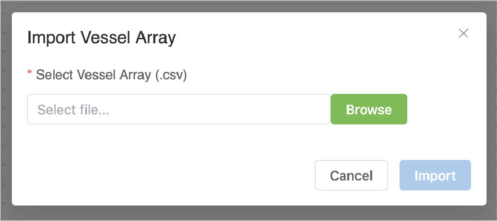

# Using PhLynx with Circulatory Autogen

PhLynx was originally designed as a companion application for [Circulatory Autogen](https://physiomelinks.github.io/circulatory_autogen/), a software package for coupling CellML modules and facilitating model calibration, parameter identifiability, and sensitivity analysis.

Existing sets of Circulatory Autogen configuration files can now be imported into PhLynx via the Vessel Array Import feature. By default, the Import button is configured to perform a Vessel Array import.

## Importing Configuration Files

Click the **Import** button in the Toolbar to open the Import Vessel Array dialog.

{.align-center width="550px"}

Select a valid `vessel_array.csv` file (see [File Types Guide](../reference/file-types#vessel-array) for reference).

### Handling Missing Definitions

If PhLynx recognizes all vessel types listed in your array, the workspace will populate immediately.

However, if your array contains vessel types that are not currently in the PhLynx internal store, you will be prompted to provide the necessary definitions.

1.  **Module Configuration:** You will be asked to upload a `module_config.json` file that matches the vessel types in your array.
2.  **Source Modules:** You may also need to upload the corresponding `.cellml` files referenced in that configuration.

Once all definitions are resolved, PhLynx will generate the graph, recreating your network topology with the correct connections and module types.

## Modifying the Network

Once imported, you can interact with the model using standard PhLynx tools:
* **Visualise:** Inspect connections and layout.
* **Edit:** Add new modules, remove obsolete ones, or re-route connections.
* **Configure:** Update port definitions or module names via the **Edit Module** dialog.

## Exporting Configuration Files

When you are ready to return to Circulatory Autogen, you must export the updated configuration files.

1.  Click the arrow next to the **Export** button in the Toolbar.
2.  Select **Configuration Files**.

### Output

PhLynx will generate and download a `.zip` archive containing the two essential files required by Circulatory Autogen:

* `vessel_array.csv`: The updated network topology defining all modules and their connections.
* `module_config.json`: The definitions for parameters, ports, and units for every module in the workspace.

### Requirements for Successful Export

To ensure the exported files are valid for simulation, ensure the following before exporting:
* At least one module is placed in the workspace.
* All connected modules have their **ports** correctly defined.
* A **Parameter File** has been loaded to correctly categorize variables (constants vs. global constants).