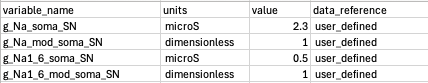

# File Formats Used by PhLynx

A concise summary of the file types and formats used by PhLynx. 

## Module File

CellML file containing module definitions. See [CellML Module Format Guide](./cellml-module-format) for how to create.

## Units

A CellML file that provides the definition of units used within a CellML module. See [CellML Units Format Guide](./cellml-units-file) for help to create.

## Parameters

A CSV file used to define whether a variable is a constant, global_constant, or variable. It has four columns:

| Column | Description | 
|---|---|
| variable_name | parameter name | 
| units | Unit name (must be defined in the CellML Units file) |
| value | Parameter value |
| data_reference | Reference of the parameter value. Typically in [last_name][date][first_word_of_paper] format for papers. | 

variable_name must follow the naming convention [module_name]_[parameter_name] for *constants* and [parameter_name] for *global constants*. Parameters not declared in the parameter file are treated as variables.

The following is an example of a parameter file.

{.align-center width="600px"}

> [!NOTE]
> All columns are required, but only variable_name is used for now.

## Workspace state

A JSON file generated by PhLynx that stores the current Workspace state. Can be imported to restore a previous session.

## Circulatory Autogen Configuration Files
PhLynx was originally designed as a companion application for Circulatory Autogen. When assembling models, Circulatory Autogen required the user provided [module definitions](file-types#module-file), a [parameter file](file-types#parameters), and two key configuration files: vessel array and module configuration.

### Module Configuration

A JSON file defining variables and ports with CellML modules. There are three main sections of a configuration definition for a given module:

- **Main specification:** Includes the vessel_type (module name), boundary condition type (module sub-type), and module_file (cellml file).
- **Ports and types:** Port definitions.
- **Variables and units:** Declaration of all variables, their units, and whether they are variables, constants, or global constants. This should coincide with the declaration in the units file.

The following is an example of an entry in a module configuration file.

{.align-center width="600px"}

From Circulatory Autogen documentation, the entries in the module_config.json file are detailed as follows:

- **vessel_type:** This will be the "vessel_type" entry in the vessel_array file
- **BC_type:** This will be the "BC_type" entry in the vessel_array file
- **module_format:** Currently only cellml is supported.
- **module_file:** The cellml file name that contains the cellml module that this config entry links to.
- **module_type:** The name of the module within the module cellml file.
- **entrance_ports:** Specification of the port types that this module can take if it is connected as an "out_vessel" to another module. If a port_type matches to the port_type of a exit_port in a module coupled as an input, then the port_types variables, e.g., [v_in, u] get mapped to the variables in the coupled modules exit port e.g., [v, u_out].
- **exit_ports:** Specification of the port types that this module can take if it is connected as an "inp_vessel" to another module.
- **general_ports:** Specification of the port types that this module can take if it is connected as any type of connection to another module. Port entries are:
  - **port_types:** The name of the type of port. If two vessels are connected vessel_a to vessel_b, and vessel_a has an exit_port with the same port_type as an entrance_port of vessel_b, then a connection will be made.
  - **variables:** These are the variables within the module that will be connected to the variables in the corresponding port of the connected vessel/module.

> [!Note]
> If you want a port variable to be able to couple to multiple other modules, you must set "multi_port": "True" as an entry within the entrance, exit, or general port.

- **variables_and_units:** This specifies all of the constants and the accesible variables of the cellml module. The entries are:
  - [0] **variable name:** corresponding to the name in the cellml file
  - [1] **variable unit:** corresponsing to the unit specification in units.cellml
  - [2] **access or no_access:** whether the variable can be accessed within the cellml simulation. This should always be "access" for accessibility, unless you want to decrease memory usage.
  - [3] **parameter type:** can be constant, global_constant, variable, or boundary_condition.
  - If parameter_type is boundary_condition it will be set to a variable accesses from another module if the corresponding port is connected. However, if the corresponding port is not connected, the boundary_condition will be set to a constant, and required to be set in the [resources_dir]/[file_prefix]_parameters.csv file

### Vessel Array

A CSV file defining the relationships between modules with shared parameters. It has five columns:

| Column | Description | 
|---|---|
| vessel_name | Equivalent to a custom module name in PhLynx | 
| BC_type | The type of the boundary condition for the vessel's input and output or more generally, the subtype of the module. |
| vessel_type | Equivalent to the default module name in PhLynx - refers to the name of a module contained in the Module List. |
| inp_vessels | Space separated list of modules that connect as an input to the module. | 
| out_vessels | Space separated list of modules that a module provides input to. | 

Every row of the vessel array file represents a specific module in the defined system. 

> [!NOTE]
> If the user wishes to set the relative position of nodes on import, the vessel array file may be extended to include an x, y, and z column. Defining position in this way is optional.

Below is an example of a vessel_array file.

{.align-center width="600px"}